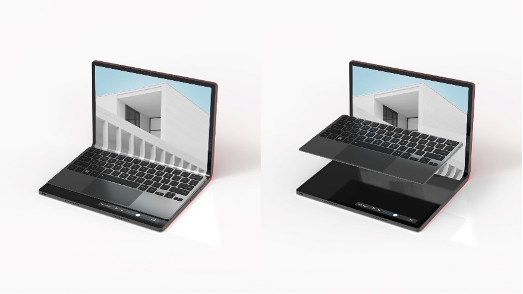
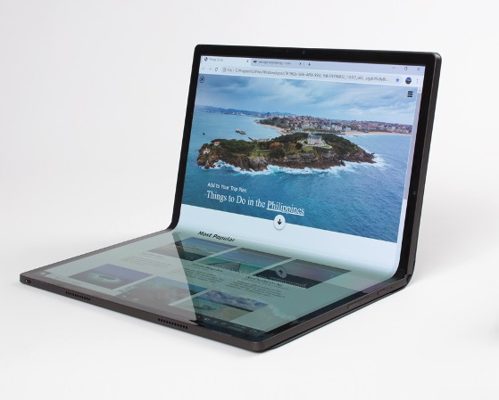
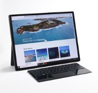
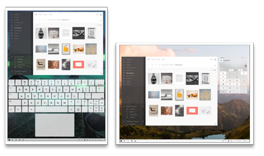
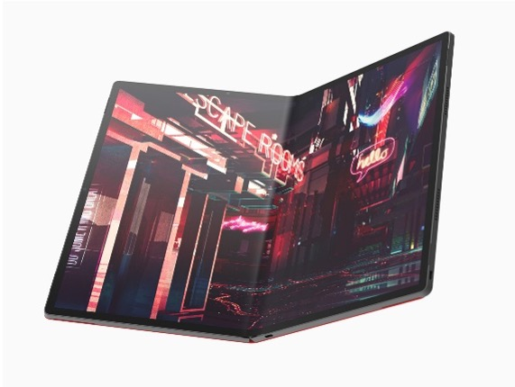

## The problem space
Microsoft Windows as of Windows 11 22H2 doesn't have any support for foldable PCs. Amongst many things, the OS is lacking APIs to :

* Access the current posture of the device.
* Establish the current screen topology, for example the fold size and fold position.

PC manufacturers have identified some of the shortcomings of Windows and most of them have created some type of support to improve the foldable experience on Windows. For example [Asus](https://www.asus.com/) have a software preinstalled, [ScreenXpert](https://apps.microsoft.com/store/detail/screenxpert/9N5RFFGFHHP6?hl=en-us&gl=us&rtc=1) which is intended to help by, for example, adding Window Manager capabilities to leverage the form factor. [Lenovo](https://lenovo.com/) has a similar software called [Mode Switcher](https://support.lenovo.com/us/en/downloads/ds546903-lenovo-mode-switcher-for-windows-10-64-bit-thinkpad-x1-fold-gen-1-types-20rk-20lk). These software come preinstalled with the laptop to provide a good out of the box user experience.

The lack of OS APIs makes it hard to support the form factor on the web or in 3rd party applications.

We will not go into details here on how websites or applications can leverage the form factor and why such support is needed. For reference a couple of demos with screenshots can be found [here](https://github.com/foldable-devices/demos), they take into account the form factor to provide a differentiated UX depending on how the user is using the device.

So how can we support the form factor provided the current landscape?

## Windows has an Hinge Angle API
It's true that Windows has an [hinge angle API](https://learn.microsoft.com/en-us/uwp/api/windows.devices.sensors.hingeanglesensor?view=winrt-22621) which could be used to derive the posture of the laptop. However this API is not enough because the hinge angle is not the only data used to compute the posture, for example if the keyboard is docked or not is an important aspect to determine the posture. The status of the kickstand (deployed or not) could also be used to determine the posture.

Obviously the hinge angle API doesn't give us any information in regards to the screen and fold position.

## Proposal
Because most foldable computer manufacturers ship some type of software to fill the gap of Windows we can try to work with them to find a way to expose the data that we need to support foldables on the web.

We have two APIs for the web targeting foldables :
* [The Device Posture API](https://www.w3.org/TR/device-posture/)
* [The Viewport Segments API](https://github.com/WICG/visual-viewport/blob/gh-pages/segments-explainer/SEGMENTS-EXPLAINER.md)

Because OEMs build and distribute their software differently it will be complicated to come up with a SDK that would work for all. Furthermore adding an external dependency may not be suitable for 3rd party apps wanting to use these foldable information.

An alternative to an SDK would be to use the Windows Registry.

In a similar fashion, Windows provide a registry entry to determine if the device is being used at a tablet or with a keyboard (for example Surface Pro devices). The API is documented [here](https://learn.microsoft.com/en-us/windows-hardware/customize/desktop/unattend/microsoft-windows-gpiobuttons-convertibleslatemode). Chromium based browsers use [this API](https://source.chromium.org/chromium/chromium/src/+/main:ui/events/devices/input_device_observer_win.cc;l=70?q=ConvertibleSlateMode&sq=) to resolve the proper primary input type and it's the recommended way to do so. Mozilla also uses this API in Firefox.

Taking insipiration from the SlateMode API we could do the same for our foldable support. This API will expose the following information:
* **Posture mode**
* **Current Rotation**
* **Rectangles (or segments)**

Here are the typical available postures :

<p align="center">
   
<br>
<ins><i>Laptop Posture</i></ins>
</p>
<p align="center">
   
<br>
<ins><i>Dual Angle Posture</i></ins>
</p>
<p align="center">
   
<br>
<ins><i>Table Top Posture</i></ins>
</p>
<p align="center">
   
<br>
<ins><i>Flat Posture</i></ins>
</p>
<p align="center">
   
<br>
<ins><i>Handheld Posture</i></ins>
</p>

The Device Posture API doesn't go into so many details but having them defined in the lower level is probably a good idea in case it's needed in the future. Rectangles (or segments) are required to populate the Viewport Segments API.

### API definition

OEMs software are required to write in the following location: ```HKEY_CURRENT_USER\Software\Intel\Foled``` . If the key/path do not exist OEMs software is required to create it.

```PostureData``` will be used as the registry key to store the posture information. To simplify the data layout for ```PostureData``` will host a JSON data structure containing the various information :

* **PostureState** : Hold the posture information with the expected values to be ```MODE_LAPTOP_KB```, ```MODE_LAYFLAT_LANDSCAPE```, ```MODE_DUAL_ANGLE```, ```MODE_TABLETOP```, ```MODE_LAYFLAT_PORTRAIT```, ```MODE_HANDHELD```.
* **DeviceRotation** : Hold the device rotation for information. Expected values: ```NotRotated```, ```Rotate90Counterclockwise```,  ```Rotate90clockwise```, ```Rotated180DegreesCounterclockwise```. They map the 4 orientations provided by Windows.
* **Rectangles** : This property contains an array of viewport segments including the fold area in physical device pixels. The number of rectangles is flexible but should always be a multiple of 3 (a segment on each side of a fold and the fold area itself). Because the data is flexible it should support more than one fold as well as asymetric folds (where the fold is not in the middle of the screen). The clients of this API, not the providers (aka OEMs software), are expected to make the necessary adjustments to the data if the scale factor of Windows is different than 100% as well as adapting the data if the content of their application is zoomed.

### Data examples of the PostureData layout

Considering the X1 Fold Gen 1 with a panel resolution of 2048px x 1536px and a fold size of 100px, here are few examples :

In the laptop posture: 
```{"PostureState":"MODE_LAPTOP_KB","DeviceRotation”:"Rotate90Counterclockwise","Rectangles":["0, 0, 1536, 1024”]} ```

In the dual angle posture:
```{"PostureState”:”MODE_DUAL_ANGLE","DeviceRotation":"Rotate90Counterclockwise","Rectangles":["0, 0, 1536, 974”,"0, 974, 1536, 100”, "0, 1074, 1536, 974” ]}```

Using the device in the handheld posture:
```{"PostureState”:”MODE_DUAL_ANGLE","DeviceRotation”:"NotRotated","Rectangles":["0, 0, 974, 1536”,”974, 0, 100, 1536”, “1074, 0 , 974, 1536” ]}```

## Long term
We hope that this work is temporary, that ultimately Microsoft will propose APIs directly in Windows to address these use cases. In this case this will be deprecated as soon as possible.

